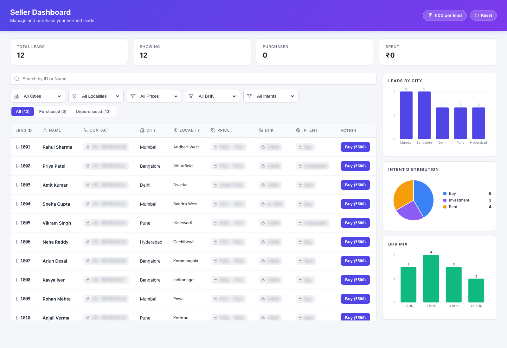

# Seller Dashboard

Lead management dashboard for property sellers. Browse verified leads, filter by city / locality / price / BHK / intent, and unlock contact details on purchase.

**Live:** https://vishalg2k.github.io/seller-dashboard/



## Features

- **Locked PII** — phone, price, BHK, intent stay blurred behind a lock icon until the lead is purchased (₹500/lead).
- **Filters** — city, locality (cascading), price range, BHK, intent, plus a Purchased / Unpurchased / All toggle.
- **Search** — by lead ID or name.
- **Live charts** (pure SVG, no chart lib):
  - Leads by City (bar)
  - Intent Distribution (pie)
  - BHK Mix (bar)
  - All charts react to active filters.
- **Stats row** — total leads, showing, purchased, spent.
- **Reset** — clears purchases, filters, and search.
- Responsive layout — charts stack below 1100px.

## Stack

- React 18 + Vite
- lucide-react (icons)
- Pure SVG charts — no external chart library
- Plain CSS

## Local development

```bash
npm install
npm run dev      # http://localhost:5173
npm run build    # output -> dist/
npm run preview  # preview prod build
```

## Deployment

Auto-deploys to GitHub Pages via [`.github/workflows/deploy.yml`](.github/workflows/deploy.yml) on every push to `main`.

Manual deploy fallback:

```bash
npm run deploy   # builds and pushes dist/ to gh-pages branch
```

## Project structure

```
src/
  main.jsx              # React entry
  App.jsx               # mounts SellerDashboard
  SellerDashboard.jsx   # dashboard component (mock data, filters, charts)
  SellerDashboard.css   # styles
  index.css             # global resets
```

Mock data lives in `MOCK_LEADS` inside `SellerDashboard.jsx`. Replace with an API fetch to wire up a real backend.
